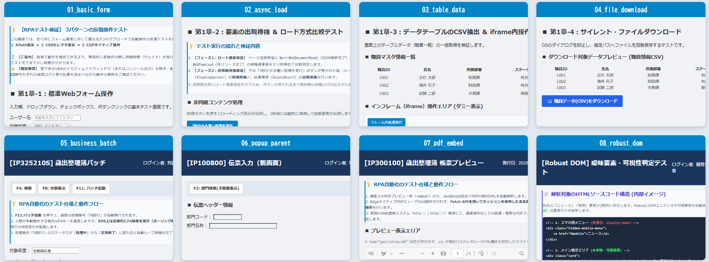

## 汎用RPA操作エンジン (VBA × PowerShell × WebView2)

**sample_BOX を追加しました。** *（公開サイトでのテストコードを追加しました。2026/08/13　内容は、修正記録で）*

Excel VBAを司令塔とし、PowerShell 5.1とEdge WebView2をバックグラウンドで連携させる、**ポータブルかつハイブリッドな内製RPAエンジン**です。<br>
Selenium等の外部ドライバや高価なRPAツールをインストールできないエンタープライズ（社内PC）環境において、指定フォルダを配置するだけで強力なブラウザ自動化を実現します。<br>

### ✨ 主な特徴 (Features)

* **ゼロ・インストール稼働:** Windows標準の PowerShell 5.1 と WebView2 ランタイムのみを使用。厳しいセキュリティ環境下でも、ファイル群をローカル（またはネットワークドライブ）に配置するだけで稼働し、煩雑な導入申請を回避できます。
* **ハイブリッド制御 (Native + CDP):** WebView2標準のJavaScript実行に加え、CDP (Chrome DevTools Protocol) 経由でのWebSocket通信をサポート。DOM APIで反応しない厳格な業務システムも、OSレベルの物理操作エミュレートで突破します。
* **型の完全維持:** 異言語間（VBA ⇔ PowerShell ⇔ JavaScript）のプロセス間通信をJSONペイロードで規格化。JS側のデータ型（Boolean, Number等）をPowerShell/VBAへ完全に維持して返却します。
* **Robust DOM (堅牢な探索):**
  * `utilFindInFrames` / `deepQuerySelector`: 多段iframeやShadow DOMの壁を透過して要素を探索。
  * レスポンシブWeb特有の「裏側に隠れたスマホ用メニュー」等の誤クリックを防ぐため、可視性(`isVisible`)を厳密に判定し、最適なCSSセレクタを動的生成して安全にクリックします。
* **Fetch APIによるサイレントダウンロード:** EdgeネイティブのPDFビューア等、UI操作が困難な画面に対し、セッションを維持したままFetch APIで裏側から直接バイナリを奪取し、完全なバックグラウンドダウンロードを実現します。

### 🧪 sandbox（_テスト環境_）を同梱

<details>
  <summary>💻 <i>( --- sandbox Screens ( 8画面 ) --- )</i></summary>
 


</details>

本リポジトリには、RPA開発でよく遭遇する **「ナゼかクリックできない？」**
**「ナゼ終わるまで待ってくれないの？」**
といった、現場特有の厄介な挙動を再現したローカルHTML群（`sandbox/`）が同梱されています。同梱のVBAテストを実行するだけで、エンジンがこれらをどう攻略するかをすぐに体験できます。

* **[T1] 基礎操作と待機 :** <sub> XPath/CSSでの操作比較や、非同期通信（ローディングスピナー）の確実な出現/消滅待機。</sub>
* **[T2-1] 疑似バッチ監視 :** <sub> 業務システム特有の「操作不可マスク（グレーアウト）」の解除待機と、F4キー押下によるステータスポーリング制御。</sub>
* **[T2-2] ポップアップ制御 :** <sub> 親画面から子画面（別窓）を開き、選択後に自ら閉じた際（`window.close`）の親画面への自動フォーカス復帰。</sub>
* **[T2-3] PDF裏側取得 :** <sub> `<embed>`表示されたPDFビューアに対し、UI操作に頼らずFetch APIを用いてセッションを維持したまま高速サイレント保存。</sub>
* **[T2-4] Robust DOM :** <sub> レスポンシブ特有の「裏側に隠れた非表示メニュー」を回避し、画面に見えている要素だけを狙撃する可視性判定テスト。</sub>

```text
 ├📊 sample_rpa_test.xlsm    # VBA ( テストシナリオ )
 ├── Ps_Engine.cls                  ( プロセス通信とAPI実行を担うRPAエンジンのコアクラス )
 ├── JsonConverter                  ( VBA-JSON ) VBAでのJSON解析
 ├── Ps_Bridge.bas                  ( JSONパース・エラー変換などのVBA側ユーティリティ )
 ├── Mod_RpaEngine_Common.bas       ( エンジンの初期化とテストの実行司令塔 )
 ├── Mod_Chapter1_Basics.bas        ( テストシナリオ：第1章 基礎操作 )
 └── Mod_Chapter2_Business.bas      ( テストシナリオ：第2章 業務システム・応用操作 )
```

👉 **[エンジンの検証・合格判定](docs/汎用RPA操作エンジン検証・合格判定.md)** ↗️ (docs/)

本RPAエンジンの機能を確認し、今後の機能追加やバージョンアップ時に既存機能が破損していないかを確認する。

### 🚀 セットアップ (Getting Started)

### 1. 前提要件
* Windows 10 / 11
* Microsoft Edge WebView2 ランタイム
* Excel (VBA環境)

**1.1 標準ディレクトリ構成**（機能順）

```text
RPA-TEST  /
 ├ 📊 Ps_Engine_Core_v204.ps1      ( エンジン本体・司令塔 )
 │   （※以下ドットソース読み込み）
 ├── Lib-WebView2_Init_v101.ps1     ( WinForms・WebView2初期化 )
 ├── Lib-WebView2_Native_v101.ps1   ( Native制御コア )
 ├── Lib-WebCDP_v101.ps1            ( CDP WebSocket通信制御 )
 ├── Lib-WebAction_v204.ps1         ( 標準Web操作アクション )
 ├── Lib-WebSafeAction_v101.ps1     ( Robust DOM安全操作アクション )
 ├── Lib-WebXPath_v101.ps1          ( XPath補正・操作アクション )
 ├── Lib-DesktopUIA_v103.ps1        ( Windows UI Automation連携 )
 └── Lib-WebDebug_v101.ps1          ( デバッグ・証跡エクスポート )
 ├ 📊 実行用マクロファイル.xlsm      ( VBA司令塔・業務ロジック )
 ├── [ Libs ]                 *必須( WebView2関連DLL )
 ├── [ sandbox ]                   ( テスト用ローカルHTML群 )
 ├── [ Logs ]              *自動作成( 実行ログ・スクショ・証跡出力先 )
 ├── [ RPA_Downloads ]     *自動作成( テスト用ダウンロード出力先 )
 └── [ UserData ]          *自動作成( WebView2のセッション・Cookie管理用UDF )
```

### 2. 外部依存ライブラリの準備
VBAでのプロセス間通信（JSON解析）のため、[VBA-JSON (JsonConverter)](https://github.com/VBA-tools/VBA-JSON) を使用しています。
> **⚠️ 必須設定:** VBA-JSONを動作させるため、VBE（VBAエディタ）のメニューから `[ツール]` ＞ `[参照設定]` を開き、**`Microsoft Scripting Runtime`** にチェックを入れてください。

また、WebView2をWinFormsで駆動させるための以下のDLLを `libs/` フォルダに配置してください（NuGet等から取得可能）。<br>
* `Microsoft.Web.WebView2.Core.dll` (基本コア)
* `Microsoft.Web.WebView2.WinForms.dll` (UI表示用)
* `WebView2Loader.dll` (PC内のEdgeランタイム本体と接続する重要ファイル。PowerShellから直接ロードはされません)<br>

_同梱のツール 「WebView2 DLL 自動セットアップ_xx」 を実行することでも自動で3つのDLLがダウンロードされ、`Libs` フォルダへ格納されます。（ときどき最新バージョンの確認は必要です。）_

<details>
  <summary>💻 <i>( --- WebView2 DLL 自動セットアップ --- )</i></summary>

```text
==================================================
 WebView2 DLL セットアップツール
==================================================
現在の実行ディレクトリ: C:\●●\RPA-TEST  /

【注意】ここはRPAプロジェクトのルートフォルダではない可能性があります。
　本来は 'sandbox' や 'Libs' フォルダが存在する階層で実行する必要があります。
このまま現在の場所に Libs フォルダを作成して処理を続行しますか？ (Y/N): y

--- WebView2 コンポーネント取得開始 ---
Target Version: 1.0.4022.49
1. Downloading WebView2 SDK from NuGet... [Success]
2. Extracting package... [Success]
3. Installing DLLs to Libs folder...
  -> Microsoft.Web.WebView2.Core.dll... [Done]
  -> Microsoft.Web.WebView2.WinForms.dll... [Done]
  -> WebView2Loader.dll... [Done]
4. Cleaning up temporary files... [Done]

セットアップ完了！
以下のファイルが C:\●●\RPA-TEST\Libs に配置されました:

Name                                Length
----                                ------
Microsoft.Web.WebView2.Core.dll     698248
Microsoft.Web.WebView2.WinForms.dll  38792
WebView2Loader.dll                  163208

Enterキーを押して終了してください...:
```
</details>

### 3. 動作確認 (sandboxテスト)
本リポジトリには、RPAの挙動を安全に検証できるローカルHTML（`sandbox/`）と、テストシナリオが組み込まれた `sample_rpa_test.xlsm` が同梱されています。

1. `sample_rpa_test.xlsm` を開く。
2. `Mod_RpaEngine_Common` モジュール内の `Test_rpaEngine` マクロを実行。
3. 以下のダイアログが表示されるので、実行したいテストシナリオ（第1章・第2章）の番号を入力すると操作テストが開始されます。

```vba
    prompt = "シナリオを選んでください：" & vbCrLf & _
            "1. 【T1】  基礎・汎用コンポーネント動作テスト" & vbCrLf & _
            "2. 【T2-1】(SYS)：バッチ処理監視＆ポーリング制御" & vbCrLf & _
            "3. 【T2-2】親画面⇒ポップアップ子画面 制御" & vbCrLf & _
            "4. 【T2-3】Fetch APIによるPDFサイレントダウンロード" & vbCrLf & _
            "5. 【T2-4】(Robust)デバッグ証跡出力＆曖昧テキスト解析"
    ans = InputBox(prompt, "テストシナリオ選択")
    
    If ans = "" Then
        MsgBox "キャンセルされました。"
    Else
        MsgBox "選択したテストシナリオ: ( " & ans & " )"
    End If
```

<details>
  <summary>🔍 <i>( --- 実行ログファイルの例 --- )</i></summary>

```vba
<2026-07-xx 15:41:49> <Info> [System] 情報: Browser/ Width-Height (1536) - (816)
 👉 VBA側から指定: If Not rpaEngine.StartEngine(sessionId, ENGINE_PATH, useCdpPort, True) Then
　…   <Info> [Engine] 実行: 関数名 | Params: { パラメータ }　/ False: パラメータを出力しない。
<2026-07-xx 15:41:49> <Info> [System] 情報: 開発モードスイッチ (True)
<2026-07-xx 15:41:49> <Info> [System] 情報: 通信モードスイッチ (9222)　/ 通信モード (0: 標準, 9222等: CDP)
<2026-07-xx 15:41:49> <Success> [System] 成功: モジュールをロード (Lib-WebAction_v201.ps1)
<2026-07-xx 15:41:49> <Success> [System] 成功: モジュールをロード (Lib-WebXPath_v101.ps1)
<2026-07-xx 15:41:50> <Success> [System] 成功: モジュールをロード (Lib-DesktopUIA_v102.ps1)
<2026-07-xx 15:41:51> <Success> [System] 成功: モジュールをロード (Lib-WebDebug_v101.ps1)
<2026-07-xx 15:41:51> <Success> [System] 成功: モジュールをロード (Lib-WebSafeAction_v101.ps1)
<2026-07-xx 15:41:51> <Info> [System] 開始: ブラウザシステムの初期化 ...
<2026-07-xx 15:41:51> <Success> [System] 成功: DLLロード (Microsoft.Web.WebView2.Core.dll Version: 1.0.4022.49)
<2026-07-xx 15:41:51> <Success> [System] 成功: DLLロード (Microsoft.Web.WebView2.WinForms.dll Version: 1.0.4022.49)
<2026-07-xx 15:41:54> <Info> [System] 起動モード: CDP有効 (Port: 9222)
<2026-07-xx 15:41:55> <Success> [System] 成功: WebView2エンジン初期化完了
<2026-07-xx 15:41:56> <Info> [System] 情報: 接続先ランタイム (Version: 150.0.4078.65)
<2026-07-xx 15:41:56> <Success> [System] 成功: モジュールをロード (Lib-WebView2_Init_v101.ps1)
<2026-07-xx 15:41:56> <Success> [System] 成功: モジュールをロード (Lib-WebView2_Native_v101.ps1)
<2026-07-xx 15:41:56> <Success> [System] 成功: モジュールをロード (Lib-WebCDP_v101.ps1)
<2026-07-xx 15:42:07> <Info> [System] 情報: CDPポート (9222) の状態 - Listen (127.0.0.1)
<2026-07-xx 15:42:08> <Info> [System] 情報: 親プロセス監視開始 (PID: 3036, Name: EXCEL)
<2026-07-xx 15:42:08> <Success> [System] 成功: エンジン待機状態
<2026-07-xx 15:42:08> <Info> [Engine] 実行: Invoke-WebNavigation | Params: {"Url":"http s://●●●challenge.com/"}
<2026-07-xx 15:42:09> <Info> [Engine] 実行: Wait-WebPageLoad | Params: {}
<2026-07-xx 15:42:15> <Info> [P01] URL更新: https:// ●●●challenge.com/
<2026-07-xx 15:42:38> <Info> [Engine] 実行: Set-EngineConfig | Params: {"EnableHighlight":false}　/ **選択ﾊｲﾗｲﾄの切り替え**
<2026-07-xx 15:42:38> <Info> [Engine] 実行: Invoke-WebClick | Params: {"Selector":"button.xxx"}
** ※ 基本的に ”エラー情報” 以外は返さない。**
```
</details>

### 📖 ドキュメント (Documentation)

アーキテクチャの詳細、待機ロジックの使い分け、エラーハンドリング機構、CDP連携の仕様については、以下の詳細設計書をご参照ください。

👉 **[汎用RPA操作エンジン 開発・運用仕様書](docs/汎用RPA操作エンジン開発・運用仕様書v1.1.docx)** ↗️ (docs/)

### 📂 ディレクトリ構成

* `src/PowerShell/` : RPAエンジンのコアロジックおよび各機能モジュール（CDP, UIA, XPath等）
* `src/VBA/` : Excel VBA用のクラスモジュールおよび連携インターフェース
* `sandbox/` : デモ・テスト用の疑似業務システムHTML群
* `Logs/` : 実行時のデバッグログ、スナップショット、画面スクショの出力先

<details>
  <summary>🔍 <i>( --- フォルダ・ファイル詳細構成 --- )</i></summary>

```text
RPA-Hybrid-Engine/
 ├── 📄 README.md                # プロジェクトの概要・使い方
 ├── 📄 LICENSE                  # ライセンス条項（MITライセンス）
 ├── 📁 docs/                    # ドキュメント類
 │    └── 📄 汎用RPA操作エンジン_内部開発・運用仕様書.md
 ├── 📁 src_PowerShell/          # PowerShell モジュール群
 │    ├── Ps_Engine_Core_v204.ps1        ( エンジン本体・司令塔 )
 │    ├── Lib-DesktopUIA_v103.ps1        ( Windows UI Automation連携 )
 │    ├── Lib-WebAction_v204.ps1         ( 標準Web操作アクション )
 │    ├── Lib-WebCDP_v101.ps1            ( CDP WebSocket通信制御 )
 │    ├── Lib-WebDebug_v101.ps1          ( デバッグ・証跡エクスポート )
 │    ├── Lib-WebSafeAction_v101.ps1     ( Robust DOM安全操作アクション )
 │    ├── Lib-WebView2_Init_v101.ps1     ( WinForms・WebView2初期化 )
 │    ├── Lib-WebView2_Native_v101.ps1   ( Native制御コア )
 │    └── Lib-WebXPath_v101.ps1          ( XPath補正・操作アクション )
 ├── 📁 src_VBA_TestScenario/    # VBA エクスポートファイル(テストシナリオ)
 │    ├── Ps_Bridge.bas                  ( JSONパース・エラー変換などのVBA側ユーティリティ )
 │    ├── Ps_Engine.cls                  ( プロセス通信とAPI実行を担うRPAエンジンのコアクラス )
 │    ├── Mod_RpaEngine_Common.bas       ( エンジンの初期化とテストの実行司令塔 )
 │    ├── Mod_Chapter1_Basics.bas        ( テストシナリオ：第1章 基礎操作 )
 │    └── Mod_Chapter2_Business.bas      ( テストシナリオ：第2章 業務システム・応用操作 )
 ├── 📁 sandbox/                 # テスト用ローカルHTML群
 │    ├── 01_basic_form.html             ( 標準Webフォーム操作とXPath/CSS/CDP比較 )
 │    ├── 02_async_load.html             ( 非同期要素の出現待機 ＆ ローディング非表示待機 )
 │    ├── 03_table_data.html             ( テーブルデータのCSV抽出 ＆ iframe操作テスト )
 │    ├── 03_frame_child.html            ( iframeテスト用の子ドキュメント )
 │    ├── 04_file_download.html          ( 標準的なファイルダウンロード制御 )
 │    ├── 05_business_batch.html         ( 業務システム特有のバッチ監視 ＆ 動的ポーリング待機 )
 │    ├── 06_popup_parent.html           ( 親画面からポップアップ子画面の呼び出し ＆ 復帰待機 )
 │    ├── 06_popup_child.html            ( ポップアップ子画面側の操作とガベージコレクション検証 )
 │    ├── 07_pdf_embed.html              ( Fetch APIによる内蔵PDFビューアからの裏側サイレント保存 )
 │    ├── 08_robust_dom.html             ( レスポンシブな隠し要素の回避・可視判定・証跡出力テスト )
 │    ├── sample_report.pdf              ( Fetchダウンロードテスト用のダミーPDFファイル )
 │    └── style_common.css               ( テスト用HTML共通のスタイル定義 )
 ├── 📁 Libs/                    # 必須DLL配置用フォルダ（空フォルダ）
 │    └── (Microsoft.Web.WebView2.Core.dll 等のNuGetパッケージを配置してください。
 │         ※PowerShellの自動セットアップスクリプトを同梱)
 └── 📊 sample_rpa_test.xlsm     # 実際に動かせるExcelマクロファイル（src_VBAのコードを組み込み済）
```
</details>

<br>

_**おわりに**_

> 無料枠のAI利用ではコード規模が大きくなり限界を感じるため、私の本エンジンの機能追加・汎用開発はこれで「総括（終了）」とします。
> （6月下旬に初めて公開してから、機能不足があり一部追加しています。READMEの編集も少しは上手になったかな。）<br>
> 近年、Claude Code等のようにAIが自動でコードを組み上げる時代（*使った事も無いし、そんな職場でも無いですが*）になりつつありますが **「VBA×PowerShell×WebView2のハイブリッド制御」「CDP通信による強行突破」「Shadow DOMや多段iframeの透過」** といった現場の泥臭い課題を解決する基礎アーキテクチャとして、**新しい視点を持つ誰か**（あるいはAI自身）がこのコードをベースに発展させてくれることを願っています。<br>

### 📜 ライセンス (License)

This project is licensed under the MIT License - see the [LICENSE](LICENSE) file for details.<br>
このプロジェクトは **MIT License** の下で公開されています。詳しくは [LICENSE](LICENSE) ファイルをご覧ください。

---

*<雑記>*
*  IE(DOM)で昔作った業務システムのRPAを今風にアップグレードしたいと思い作業開始！
* PCのセキュリティ（Selenium等のインストール）に邪魔され、エクセルなら何とかなるかで始めPowerShell×VBA（標準入出力JSON通信）を基盤とした汎用RPA操作エンジンを完成できましたが、そもそもレガシー（時代遅れ）！。
* WebView2（Edge）を活用した自動化は、IE時代とは違う非同期への対応、自前のRPAエンジン作成などする時代では無いと思いますが、職場のPCには普通にあるVBA×powershellを使わないのも！？
* これだけAIさんが身近で応援してくれて、無料で簡単な操作コードが作成出来る時代はありがたい。
* 6月末に初めてGITHUB、QIITAを利用し、はや一月、編集の仕方も「ままならない」中、何度かコード改修、記事投稿で、少しは上手になったか
